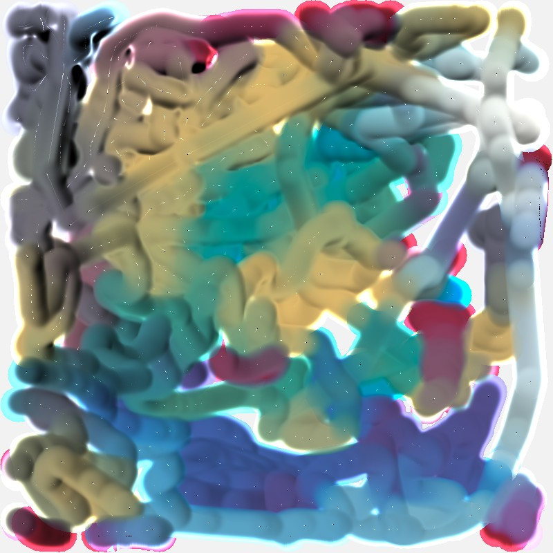

physically accurate 2D color mixier using K-M theory, go to [kode-fast.github.io](https://kode-fast.github.io/) to try.
- click + drack to paint
- click a pallet color to switch primary colors
- C to pick a color on canvas

